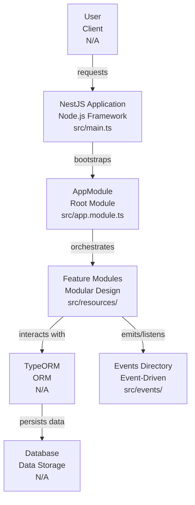

# Technical Report: NestJS API Architecture

## Overview

This project follows the NestJS standard modular architecture. It exposes a RESTful API, provides Swagger documentation, integrates with external services, and includes robust scheduling, event-driven features, and detailed logging.

## Key Decisions and Patterns

### ✅ CRUD with `@dataui/crud`
To avoid repetitive controller and service logic for basic resources, we leveraged `@dataui/crud`. This generates routes and handles sorting, pagination, and filtering by default. Custom endpoints are extended where necessary.

### ✅ Event-Driven Architecture
`@nestjs/event-emitter` is used to decouple features. Instead of importing services directly, domain events are dispatched and handled only by listeners that need them. This reduces coupling and makes it easier to extend the app.

### ✅ Axios Interceptors for Secrets
All third-party integrations are funneled through a central integration layer. Axios interceptors are used to inject API keys or headers securely, avoiding leakage or repeated logic in modules.

### ✅ Scheduler for Periodic Tasks
`@nestjs/schedule` is used for cron jobs (e.g., syncing with Fuse API). Jobs are placed inside a `scheduler/` module and properly registered via `ScheduleModule`.

### ✅ Logging with Winston
All logs go through the Winston logger setup. This allows JSON-formatted logs for production and colorized output for local development. Different levels (debug, info, warn, error) are used throughout the code.

### ✅ Swagger and API Docs
Clear API documentation is generated with `@nestjs/swagger`. DTOs, validation, and route descriptions are included for easy onboarding of consumers or QA teams.

## Deployment Considerations

- Uses Docker for local development and CI/CD compatibility
- Database readiness ensured via `wait-for-it.sh` pattern in entrypoint
- Environment variables set via `.env` or `docker-compose.yml`
- Prepared for horizontal scaling due to modular decoupling

---

This design ensures a scalable, maintainable, and secure backend API that can evolve with minimal changes across modules.

## High-Level Architecture

This project is a **NestJS** application, a progressive Node.js framework for building efficient, reliable, and scalable server-side applications. It follows a modular architecture, organizing features into distinct modules that encapsulate related functionalities. The application leverages **TypeORM** for database interaction and implements a clear separation of concerns, with dedicated modules for resources (e.g., users, portfolios, stocks), integrations, notifications, and logging.

The core application is bootstrapped via [main.ts](src/main.ts), which sets up the NestJS application context and registers the root [AppModule](src/app.module.ts). This module then imports and orchestrates other feature modules.

Key architectural patterns included:
*   **Modular Design:** Functionalities are grouped into self-contained modules.
*   **Dependency Injection:** NestJS's built-in DI container is used extensively for managing dependencies between services and controllers.
*   **Layered Architecture:** Separation into controllers (handling HTTP requests), services (business logic), and entities/DTOs (data representation).
*   **Event-Driven:** The presence of an [events/](src/events/) directory suggests an event-driven approach for certain functionalities, likely for decoupling components.

## Mid-Level Component Breakdown

```mermaid
graph TB
  appModule["AppModule<br>Root Module<br>src/app.module.ts"]
  mainTs["main.ts<br>Entry Point<br>src/main.ts"]
  appController["AppController<br>HTTP Handler<br>src/app.controller.ts"]
  appService["AppService<br>Business Logic<br>src/app.service.ts"]
  configModule["ConfigModule<br>Configuration<br>src/config/datasource.module.ts"]
  loggerModule["LoggerModule<br>Logging<br>src/logger/winston.config.ts"]
  resourceModules["Resource Modules<br>Feature Modules<br>src/resources/"]
  integrationsModule["Integrations Module<br>External Services<br>src/integrations/"]
  notificationsModule["Notifications Module<br>Messaging<br>src/notifications/"]
  eventsModule["Events Module<br>Event Definitions<br>src/events/events.ts"]

  mainTs --> |"starts"| appModule
  appModule --> |"imports"| configModule
  appModule --> |"imports"| loggerModule
  appModule --> |"imports"| resourceModules
  appModule --> |"imports"| integrationsModule
  appModule --> |"imports"| notificationsModule
  appModule --> |"imports"| eventsModule
  appModule --> |"uses"| appController
  appModule --> |"uses"| appService

  subgraph Core Application Module
    appModule
    mainTs
    appController
    appService
  end

  subgraph Configuration Module
    configModule
    datasourceModule["datasource.module.ts<br>TypeORM Config<br>src/config/datasource.module.ts"]
    envValidation["env.validation.ts<br>Env Validation<br>src/config/env.validation.ts"]
    databaseService["database.service.ts<br>DB Utilities<br>src/config/database.service.ts"]
    crudConfig["crud.config.ts<br>CRUD Config<br>src/config/crud.config.ts"]
    configModule --> datasourceModule
    configModule --> envValidation
    configModule --> databaseService
    configModule --> crudConfig
  end

  subgraph Resources Modules
    resourceModules
    usersModule["UsersModule<br>User Management<br>src/resources/users/users.module.ts"]
    portfoliosModule["PortfoliosModule<br>Portfolio Management<br>src/resources/portfolios/portfolios.module.ts"]
    stocksModule["StocksModule<br>Stock Data<br>src/resources/stocks/stocks.module.ts"]
    transactionsModule["TransactionsModule<br>Trade Processing<br>src/resources/transactions/transactions.module.ts"]
    reportsModule["ReportsModule<br>Reporting<br>src/resources/reports/reports.module.ts"]
    resourceModules --> usersModule
    resourceModules --> portfoliosModule
    resourceModules --> stocksModule
    resourceModules --> transactionsModule
    resourceModules --> reportsModule
    portfoliosModule --> |"uses"| stocksModule
    transactionsModule --> |"uses"| portfoliosModule
    transactionsModule --> |"uses"| stocksModule
    reportsModule --> |"listens to"| eventsModule
  end

  subgraph Integrations Module
    integrationsModule
    fuseModule["FuseModule<br>External API<br>src/integrations/fuse/fuse.module.ts"]
    fuseService["FuseService<br>API Orchestration<br>src/integrations/fuse/fuse.service.ts"]
    fuseStocksService["StocksService<br>Stock Data Fetch<br>src/integrations/fuse/stocks/stocks.service.ts"]
    integrationsModule --> fuseModule
    fuseModule --> fuseService
    fuseService --> fuseStocksService
    stocksModule --> |"uses"| fuseStocksService
  end

  subgraph Notifications Module
    notificationsModule
    notificationsMod["NotificationsModule<br>Notification Service<br>src/notifications/notifications.module.ts"]
    emailService["EmailService<br>Email Sending<br>src/notifications/email.service.ts"]
    notificationsModule --> notificationsMod
    notificationsMod --> emailService
    transactionsModule --> |"sends via"| emailService
  end

  subgraph Logger Module
    loggerModule
    winstonConfig["winston.config.ts<br>Logger Config<br>src/logger/winston.config.ts"]
    logLevelsConfig["log-levels.config.ts<br>Log Levels<br>src/logger/log-levels.config.ts"]
    formats["formats.ts<br>Log Formats<br>src/logger/formats.ts"]
    transportsDir["transports/<br>Log Transports<br>src/logger/transports/"]
    loggerModule --> winstonConfig
    loggerModule --> logLevelConfig
    loggerModule --> formats
    loggerModule --> transportsDir
  end

  subgraph Events Module
    eventsModule
    eventsTs["events.ts<br>Event Definitions<br>src/events/events.ts"]
    eventsModule --> eventsTs
  end
```

### Core Application Module

The central module that ties everything together.
*   **Purpose:** Initializes the NestJS application, registers global configurations, and imports all feature modules.
*   **Internal Parts:**
    *   [AppModule](src/app.module.ts): The root module, importing other modules like [ConfigModule](src/config/datasource.module.ts), [LoggerModule](src/logger/winston.config.ts), and all resource modules.
    *   [AppController](src/app.controller.ts): Basic application-level routes (e.g., health checks).
    *   [AppService](src/app.service.ts): Basic application-level business logic.
    *   [main.ts](src/main.ts): The entry point of the application, responsible for creating and starting the NestJS application instance.
*   **External Relationships:** Imports and orchestrates all other feature modules, acting as the application's entry point for incoming requests.

### Configuration Module

Manages application-wide settings and database connections.
*   **Purpose:** Provides a centralized way to load and validate environment variables and configure database connections.
*   **Internal Parts:**
    *   [datasource.module.ts](src/config/datasource.module.ts): Configures and provides the TypeORM data source.
    *   [env.validation.ts](src/config/env.validation.ts): Defines schema for environment variable validation using Joi.
    *   [database.service.ts](src/config/database.service.ts): Likely contains logic for database-specific configurations or utilities.
    *   [crud.config.ts](src/config/crud.config.ts): Potentially defines generic CRUD operation configurations.
*   **External Relationships:** Used by various services and modules that require database access or environment-specific settings.

### Resources Modules

These modules represent the core business entities and their associated API endpoints. Each resource typically follows a similar structure:
*   **Purpose:** Expose RESTful APIs for managing specific entities (e.g., users, portfolios, stocks, transactions) and encapsulate their business logic.
*   **Internal Parts (Example: Portfolios):**
    *   [PortfoliosController](src/resources/portfolios/portfolios.controller.ts): Handles HTTP requests related to portfolios.
    *   [PortfoliosService](src/resources/portfolios/portfolios.service.ts): Contains the business logic for portfolio operations, interacting with the database via [PortfolioEntity](src/resources/portfolios/entities/portfolio.entity.ts).
    *   [PortfoliosModule](src/resources/portfolios/portfolios.module.ts): Registers the controller, service, and repository for portfolios.
    *   [PortfolioDto](src/resources/portfolios/dto/portfolio.dto.ts): Data Transfer Objects for request/response payloads.
    *   [PortfolioEntity](src/resources/portfolios/entities/portfolio.entity.ts): TypeORM entity definition for the `Portfolio` table.
*   **External Relationships:**
    *   **Users:** [UsersModule](src/resources/users/users.module.ts) manages user accounts.
    *   **Stocks:** [StocksModule](src/resources/stocks/stocks.module.ts) manages stock information.
    *   **Transactions:** [TransactionsModule](src/resources/transactions/transactions.module.ts) handles buying/selling stocks, likely interacting with both `Portfolios` and `Stocks`.
    *   **Reports:** [ReportsModule](src/resources/reports/reports.module.ts) likely generates reports based on data from other resources, potentially using listeners ([reports.listener.ts](src/resources/reports/reports.listener.ts)) and schedulers ([reports.scheduler.ts](src/resources/reports/reports.scheduler.ts)).

### Integrations Module

Handles communication with external services.
*   **Purpose:** Provides a dedicated layer for integrating with third-party APIs, specifically **Fuse** for stock-related data.
*   **Internal Parts:**
    *   [FuseModule](src/integrations/fuse/fuse.module.ts): Registers the Fuse service.
    *   [FuseService](src/integrations/fuse/fuse.service.ts): Orchestrates calls to the Fuse API.
    *   [StocksService](src/integrations/fuse/stocks/stocks.service.ts): Specifically handles fetching stock data from the Fuse integration.
*   **External Relationships:** Consumed by internal services (e.g., [StocksService](src/resources/stocks/stocks.service.ts) in the resources module) that require external stock information.

### Notifications Module

Manages sending various types of notifications.
*   **Purpose:** Provides services for sending notifications, such as emails.
*   **Internal Parts:**
    *   [NotificationsModule](src/notifications/notifications.module.ts): Registers notification services.
    *   [EmailService](src/notifications/email.service.ts): Handles sending emails.
*   **External Relationships:** Used by other services (e.g., [TransactionsService](src/resources/transactions/transactions.service.ts) after a successful transaction) to send user notifications.

### Logger Module

Provides centralized logging capabilities.
*   **Purpose:** Configures and provides a consistent logging mechanism across the application, likely using Winston.
*   **Internal Parts:**
    *   [winston.config.ts](src/logger/winston.config.ts): Main configuration for Winston logger.
    *   [log-levels.config.ts](src/logger/log-levels.config.ts): Defines custom log levels.
    *   [formats.ts](src/logger/formats.ts): Defines log message formats.
    *   [transports/](src/logger/transports/): Contains definitions for different log transports (e.g., [console.transport.ts](src/logger/transports/console.transport.ts)).
*   **External Relationships:** Injected into various services and controllers to log application events, errors, and debugging information.

### Events Module

Defines application-wide events.
*   **Purpose:** Centralizes the definition of events that can be dispatched and listened to within the application, promoting loose coupling.
*   **Internal Parts:**
    *   [events.ts](src/events/events.ts): Likely contains enums or constants for event names and interfaces for event payloads.
*   **External Relationships:** Used by services to emit events and by listeners (e.g., [reports.listener.ts](src/resources/reports/reports.listener.ts)) to react to those events.
